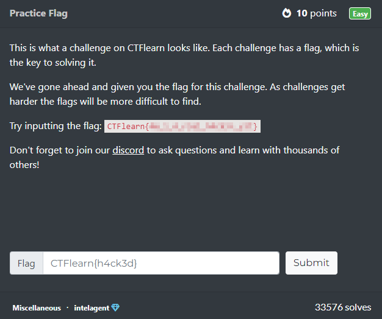
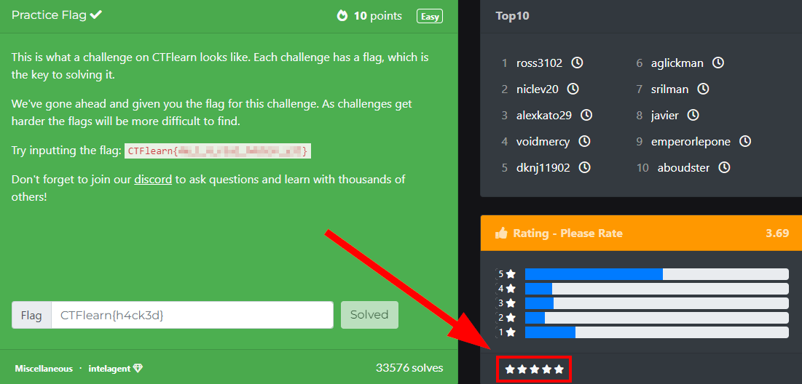

# Practice Flag

This is a beginner CTF designed for people who are using CTFlearn for the first time.

## Summary

Creator | Points| Difficulty
:--------: | :--------: | :--------:
[intelagent](https://ctflearn.com/user/intelagent) | 10 | Easy

## Task

This is what a challenge on CTFlearn looks like. Each challenge has a flag, which is the key to solving it.

We've gone ahead and given you the flag for this challenge. As challenges get harder the flags will be more difficult to find.

Try inputting the flag: **CTFlearn{███████████}**

Don't forget to join our discord to ask questions and learn with thousands of others!

## Solution

Click here to see the solution

When you enter the Challenge by going to https://ctflearn.com/challenge/125 the flag will be shown to you in red text.

You just have to copy and insert it in the flag box. After that you have to hit Solved and the Challenge will be marked as solved by turning to green.

*Spoiler*: CTFlearn{h4ck3d} is not the real flag. ;)

***Don't forget to rate the challenge! :)***

### Side Note

Please rate every challenge after completing it. If have tips or problems just comment under the challenge. This will get you in touch with the CTFlearn community and I'm sure you will find help there. Sometimes users give hints in the comments, so if you're stuck look out for some hints in the comments. 

But first try it out yourself, some spoilers are clearer than others.