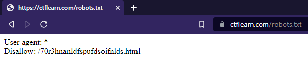
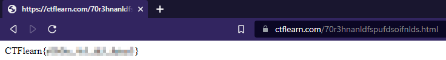

# Where Can My Robot Go?

## Summary

Creator | Points| Difficulty
:--------: | :--------: | :--------:
[intelagent](https://ctflearn.com/user/intelagent) | 30 | Easy

## Task

Where do robots find what pages are on a website?

Hint:

<blockquote>What does disallow tell a robot?</blockquote>

## Solution

Click here to see the solution

<blockquote>Where do robots find what pages are on a website?</blockquote>

This hints to the robots.txt file used by browsers to identify files which URLs a search engine can access on your site. This is used mainly to avoid overloading your site with requests. If you want to know more about the robots.txt file here's an [Introduction to robots.txt](https://developers.google.com/search/docs/advanced/robots/intro) by Google.

The robots.txt file for any given website can typically be viewed by typing the full URL for the homepage and then adding /robots.txt. So if we go to the robots.txt file on the CTFlearn website we see the following:

### User-agent: *

Any person or program active on the Internet will have a "user agent," or an assigned name. CTFlearn has included "User-agent: *" in the robots.txt file. The asterisk represents a "wild card" user agent, and it means the instructions apply to every bot, not any specific bot.

### Disallow

The Disallow command is the most common in the robots exclusion protocol. It tells bots not to access the webpage or set of webpages that come after the command. In our case we see a HTML file was put in the robots.txt file. What happens if we put it behind ctflearn.com?

We got the flag! Yeah! So now all you have to do is to copy and insert the flag into the flag box.

***Don't forget to rate the challenge! :)***

### Sources:

* [Google - Introduction to robots.txt](https://developers.google.com/search/docs/advanced/robots/intro)
* [Cloudflare - What is robots.txt](https://www.cloudflare.com/learning/bots/what-is-robots.txt/)